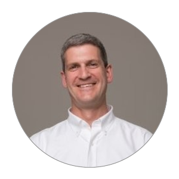

# Edward Bridges

> Engineering leader with 20+ years building and running product engineering organizations — from hedge fund administration systems to healthcare data platforms to consumer software used by tens of millions of people. I work across the full range, from IC-depth systems work to leading orgs of 50+, across fintech, healthtech, media, and proptech.

Full work history → [LinkedIn](https://www.linkedin.com/in/eqbridges)

[Scope and impact](#scope-and-impact) · [Open source](#open-source) · [Currently](#currently)

---

## Scope and impact

| Company | Highlight |
|---|---|
| Squarespace | Grew mobile org 2 → 50+ engineers; led Unfold acquisition integration & BioSites launch (2021 Super Bowl ad, cited in S-1) |
| GreenLite | Built agentic AI plan-review system (15 → 300+ reviews/mo); led Terraform/IaC migration; grew org 3 → 11 |
| Aetion | Led core platform team; Spark/Databricks migration cut response time 80% on 200M+ patient datasets |
| Citco Fund Services | Re-architected derivatives pricing & risk/scenario engine |

### Accomplishments

<b>Squarespace</b> · Consumer / media software

 

- Grew a mobile engineering org from 2 people to 50+, globally distributed, shipping 10+ apps
- Led integration of the Unfold acquisition (5-6M MAU), scaling that team from 7 to 20+ engineers and shipping BioSites — featured in Squarespace's 2021 Super Bowl ad and cited 25x in the company's S-1
- Led the org's response to an App Store-wide ban over in-app-purchase compliance, shipping a compliant rebuild across all three apps within a year with zero team attrition

<b>GreenLite</b> · Proptech / construction tech

 

- Designed and built an agentic AI system — OCR, vector search, and a knowledge graph — for automated construction plan-set review, taking plan-review throughput from ~15/month to 300+/month
- Led the migration to infrastructure-as-code (Terraform) as part of bringing the company into SOC2 Type 2 compliance, alongside a pen test and SOC observation period
- Grew the org from an inherited 3-person full-stack team to ~11 people (part of a 17-person product/eng/design team), standing up new AI, data, and SRE functions while mentoring the original engineers into more senior roles

<b>Aetion</b> · Healthtech

 

- Led the team behind the core business logic of a regulatory-grade real-world-evidence platform used by pharma and payers, operating on datasets up to 50TB / 200M+ patients
- Directed the migration off a proprietary datastore onto Spark/Databricks, cutting application response time by 80%

<b>Citco Fund Services</b> · Fintech

 

- Early-career systems work: re-architected a hedge fund administration platform's accounting, derivatives pricing, and risk/scenario-analysis services onto a .NET/Java client-server system

---

## Open source

- **[Wakil: a knowledge base assistant](https://github.com/ebridges/)** - a local-first Python CLI agent for working with a personal Markdown knowledge base (GBrain / Obsidian style): ingest, search, connect, revise, and reason over Markdown notes.
- **[minimal-neural-network](https://github.com/ebridges/minimal-neural-network)** — a neural network implemented in C with no external dependencies (forward/backward propagation), with a JS/React UI for using it.
- **[elektrum](https://github.com/ebridges/elektrum)** — a self-hosted alternative to Google Photos (Python/JS), with automated AWS infrastructure via Ansible.
  - [lgw](https://github.com/ebridges/lgw) — deploy an app as a Lambda behind API Gateway
  - [metadata-processor](https://github.com/ebridges/metadata-processor) — image metadata extraction for storage/search
  - [thumbnailer](https://github.com/ebridges/thumbnailer) — efficient image thumbnailing

---

## Currently

Deep in applied agentic AI/LLM engineering — production systems, not demos — plus data analytics.

---

Outside of engineering, I build furniture with hand tools (workbenches, dovetail joinery, and inspired by George Nakashima), lean toward Jazz, Classical, and New York's late-70s art-rock and post-punk sounds, and live in Williamsburg, Brooklyn.

[LinkedIn](https://www.linkedin.com/in/eqbridges) · [GitHub](https://github.com/ebridges)
